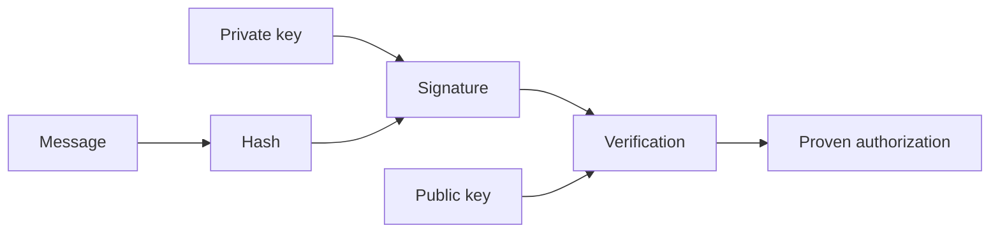

# crypto-lab

Applied cryptography lab for learning the building blocks that make digital
ownership, authorization, and integrity possible.

This repository is educational. It uses Node.js built-in `crypto` for mature
hashing and Ed25519 signatures, but the Merkle tree and replay examples are
written for clarity, not production hardening.

## Learning Goal

By the end of this lab, you should be able to explain:

- why a hash is not reversible;
- why a signature proves authorization/authenticity, not secrecy;
- why a nonce prevents repeated use of the same signed command;
- why domain separation prevents a valid signature from being reused in the
  wrong context;
- why home-made cryptography in production is a serious mistake;
- why EVM signature verification code becomes less mysterious once these blocks
  are familiar.

## Resources

- Stanford Cryptography I, Dan Boneh:
  <https://crypto.stanford.edu/~dabo/courses/OnlineCrypto/>
- A Graduate Course in Applied Cryptography:
  <https://toc.cryptobook.us/>
- CryptoHack:
  <https://cryptohack.org/>
- Practical Cryptography for Developers:
  <https://cryptobook.nakov.com/>
- MIT Blockchain and Money, sessions 2 to 6:
  <https://ocw.mit.edu/courses/15-s12-blockchain-and-money-fall-2018/resources/lecture-videos/>

Recommended video topics:

- collision-resistant hashing;
- MACs;
- digital signatures;
- elliptic curves;
- blockchain transaction authorization.

## Mental Model



## Run The Lab

```bash
npm test
npm --silent start
```

When you run `npm --silent start`, the terminal asks for a message. The lab
uses that message for hashing, Merkle inclusion, signing, replay simulation,
and the nonce/domain-separation fix.

The same output printed in the terminal is saved to:

```text
examples/log.txt
```

You can also pipe a message without using the interactive prompt:

```bash
printf "transfer 25 tokens to alice\n" | npm --silent start
```

No external packages are required. `npm run demo` is kept as an alias for the
same interactive flow.

## Core Pieces

### 1. Message Hash

Input:

- message

Output:

- digest

Goal: prove integrity. If the message changes, the digest changes.

Implementation:

- [src/hash.js](src/hash.js)

### 2. Merkle Tree

Input:

- list of messages or transactions

Output:

- root;
- intermediate nodes;
- proofs.

Goal: learn verifiable aggregation.

Implementation:

- [src/merkle.js](src/merkle.js)

### 3. Proof Of Inclusion

Input:

- item;
- path of sibling hashes;
- root.

Output:

- `true` or `false`.

Goal: prove that one item is included without exposing the entire list.

Implementation:

- `MerkleTree#getProof(index)`;
- `verifyInclusion(item, proof, root)`.

### 4. Digital Signature

Input:

- message;
- private key.

Output:

- signature.

Verification input:

- message;
- signature;
- public key.

Goal: learn authorization and authenticity.

Implementation:

- [src/signatures.js](src/signatures.js)

This lab uses Ed25519 through Node's built-in `crypto` module. The signing
primitive is mature; the surrounding examples are intentionally small for
learning.

### 5. Replay Attack

Input:

- a valid signed message.

Attack:

- submit the exact same signed message again.

Goal: prove that a signature alone is not enough. If a system accepts "transfer
25 tokens" once, it may accept the exact same signed command again unless the
system tracks one-time use.

Implementation:

- `simulateReplayAttack(...)` in [src/replay.js](src/replay.js)

### 6. Nonce And Domain Separation

Input:

- structured message with context/domain;
- nonce;
- signature.

Goal: prevent repeated execution and prevent a signature from being reused in a
different context.

Implementation:

- `NonceLedger`;
- `createProtectedCommand(...)`;
- `simulateReplayFix(...)`.

A protected signed payload in this lab looks like:

```json
{
  "domain": "crypto-lab/transfer/v1",
  "nonce": "nonce-0001",
  "action": "transfer",
  "to": "alice",
  "amount": 25
}
```

The nonce makes the command single-use within the ledger. The domain makes the
signed bytes explicitly belong to one protocol context.

## Encoding, Hashing, Encryption, Signature

Encoding changes representation and is reversible when you know the encoding.
Example: UTF-8 text to hex, then hex back to UTF-8.

Hashing compresses data into a fixed-size digest. It is designed to be one-way:
you verify by hashing the same input again and comparing digests.

Encryption hides data from readers who do not have the decryption key. It is
reversible for the authorized key holder.

A signature does not hide the message. It proves that the holder of the private
key authorized the exact bytes that were signed.

## Exercises

- Differentiate encoding, hashing, encryption, and signature.
- Hash a message and change one character to observe the digest change.
- Build a Merkle tree from a list of transactions.
- Generate a proof of inclusion.
- Verify a proof of inclusion.
- Tamper with the item, proof, or root and watch verification fail.
- Sign a message using Node's mature Ed25519 implementation.
- Verify the signature.
- Simulate a replay attack.
- Fix replay with nonce tracking.
- Add domain separation to stop cross-context reuse.
- Write down which parts are educational and which parts rely on safe library
  primitives.

## Safety Notes

Safe to learn from:

- SHA-256 via Node's `crypto`;
- Ed25519 signing and verification via Node's `crypto`;
- the concept of domain-separated Merkle leaf and node hashing;
- nonce tracking as a protocol idea.

Not safe to copy into production without deeper review:

- this Merkle tree format;
- this in-memory nonce ledger;
- this command schema;
- this demo-level key handling;
- any custom cryptographic protocol assembled from snippets.

Production cryptography should use audited protocols, reviewed libraries, clear
threat models, and careful key management.
